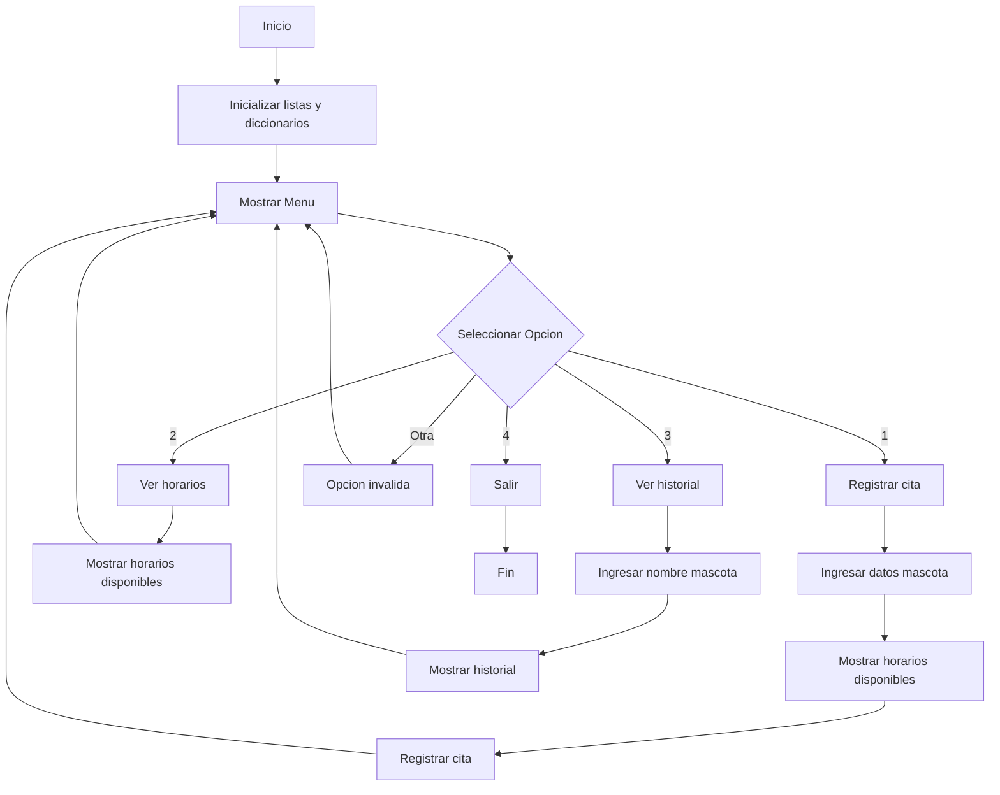
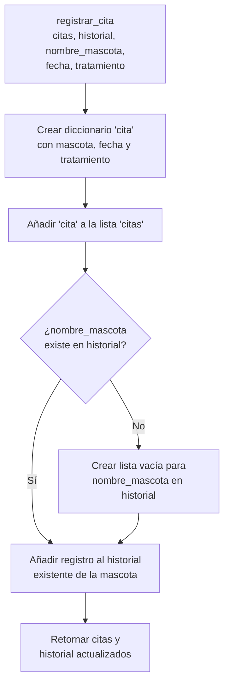
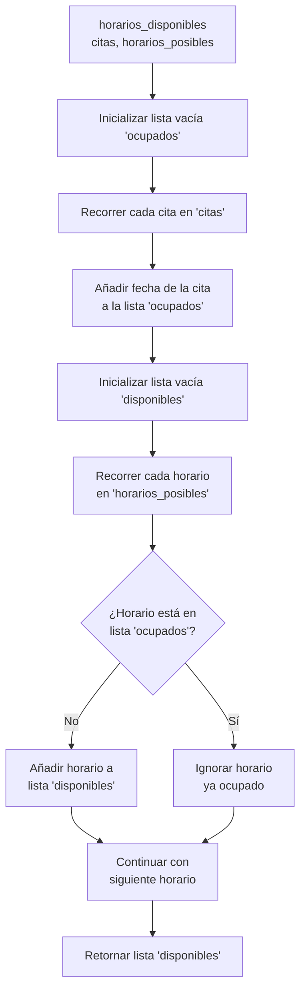
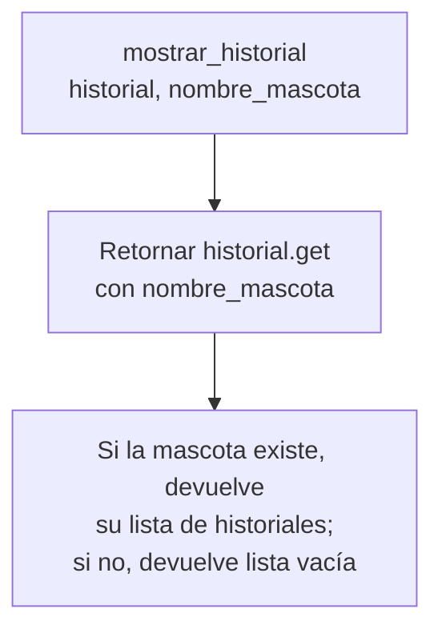

# Diagrama de Flujo del Sistema VetCare

Este diagrama representa el flujo de ejecución del sistema de gestión de citas veterinarias.

## Diagrama de Flujo Principal

## Diagrama de la función `registrar_cita`

## Diagrama de la función `horarios_disponibles`

## Diagrama de la función `mostrar_historial`

