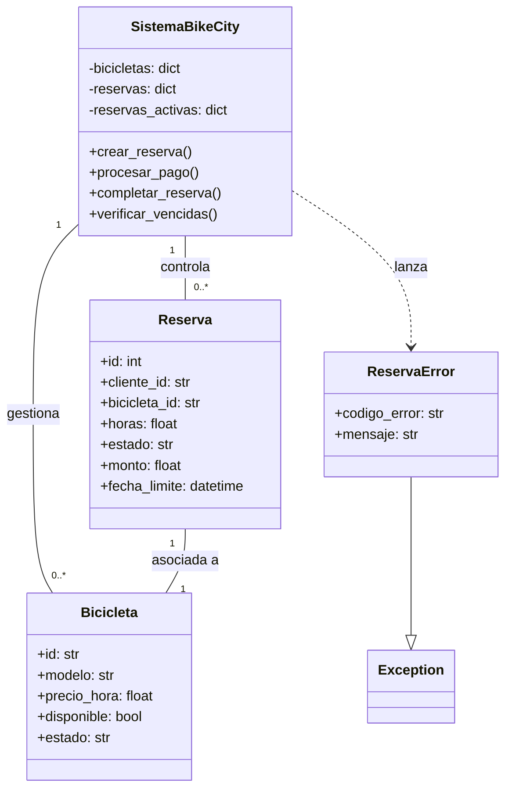

# Sistema de Reservas BIKECITY 

## Descripcion General

BikeCity es un sistema para reservas de bicicletas que demuestra el manejo robusto de excepciones en Python. 

## Problemas Resueltos

### Problemas Identificados:
1. **Reservas duplicadas** por falta de sincronizacion entre socios
2. **Clientes que no recogen** las bicicletas reservadas, generando perdidas
3. **Cobros incorrectos** debido a errores en calculos manuales
4. **Falta de registro** sobre bicicletas disponibles y su estado

### Soluciones Implementadas:
1. **Control de reservas unicas** por cliente
2. **Sistema de vencimiento** automatico (1 hora)
3. **Validacion exacta de montos** de pago
4. **Registro centralizado** del estado del sistema

## Requerimientos Tecnicos Cumplidos

**Clases para representar bicicletas y reservas**
**try/except para manejar errores del sistema**
**Captura multiple de excepciones en el mismo bloque**
**raise para generar excepciones en errores de reservas**
**Excepcion personalizada para casos especificos**
**finally para acciones de limpieza y logs**

## Diagrama de Clases



## Manejo de Excepciones

### Estrategia de Multiples Excepciones
```python
try:
    # Operacion de reserva
except ValueError as e:
    # Errores de validacion de datos
except KeyError as e:
    # Errores de datos no encontrados
except ReservaError as e:
    # Errores especificos del negocio
except Exception as e:
    # Errores inesperados
finally:
    # Limpieza y logging garantizados
```

### Excepcion Personalizada
```python
class ReservaError(Exception):
    def __init__(self, mensaje, codigo_error=None):
        self.codigo_error = codigo_error
        super().__init__(mensaje)
```

**Codigos de error especificos:**
- `RESERVA_DUPLICADA`: Cliente ya tiene reserva activa
- `NO_DISPONIBLE`: Bicicleta no disponible
- `MONTO_INCORRECTO`: Error en calculo de pago
- `ESTADO_INVALIDO`: Operacion en estado incorrecto

## Casos de Uso

### 1. Reserva Exitosa
```python
reserva_id = sistema.crear_reserva("CLI001", "B001", 2)
sistema.procesar_pago(reserva_id, 12000)
```

### 2. Reserva Duplicada
```python
# Primera reserva OK
sistema.crear_reserva("CLI001", "B001", 2)
# Segunda reserva del mismo cliente -> ReservaError
sistema.crear_reserva("CLI001", "B002", 1)
```

### 3. Bicicleta No Disponible
```python
# Intento de reservar bicicleta ya ocupada
sistema.crear_reserva("CLI002", "B001", 1)  # -> ReservaError
```

### 4. Error de Calculo
```python
reserva_id = sistema.crear_reserva("CLI003", "B002", 3)  # 3h x $4000 = $12000
sistema.procesar_pago(reserva_id, 10000)  # Monto incorrecto -> ReservaError
```

## Estados del Sistema

### Estados de Bicicleta
- **Bueno**: Disponible para alquiler
- **Malo/Mantenimiento**: No disponible

### Estados de Reserva
- **Pendiente**: Creada, esperando pago y recogida
- **Activa**: Pagada, bicicleta en uso
- **Completada**: Devuelta exitosamente
- **Cancelada**: Anulada (por vencimiento o cliente)

## Funciones de Limpieza (finally)

En cada operacion critica se ejecutan acciones de limpieza:

```python
finally:
    # Registro de operacion
    print(f"Operacion procesada: {detalles}")
    # Cierre de conexiones simulado
    conexion_activa = False
    # Log de estado final
    print("Limpieza completada")
```

## Ejecucion

```bash
python bikecity.py
```

**Salida esperada:**
- Inicializacion del sistema con 3 bicicletas
- Ejemplo de reserva exitosa
- Manejo adecuado de cada tipo de excepcion
- Acciones de limpieza garantizadas

## Beneficios del Diseño

1. **Robustez**: Manejo especifico de cada tipo de error
2. **Claridad**: Mensajes descriptivos para cada problema
3. **Simplicidad**: Codigo facil de entender para estudiantes
4. **Trazabilidad**: Registro de todas las operaciones
5. **Prevencion**: Evita los problemas identificados del negocio
