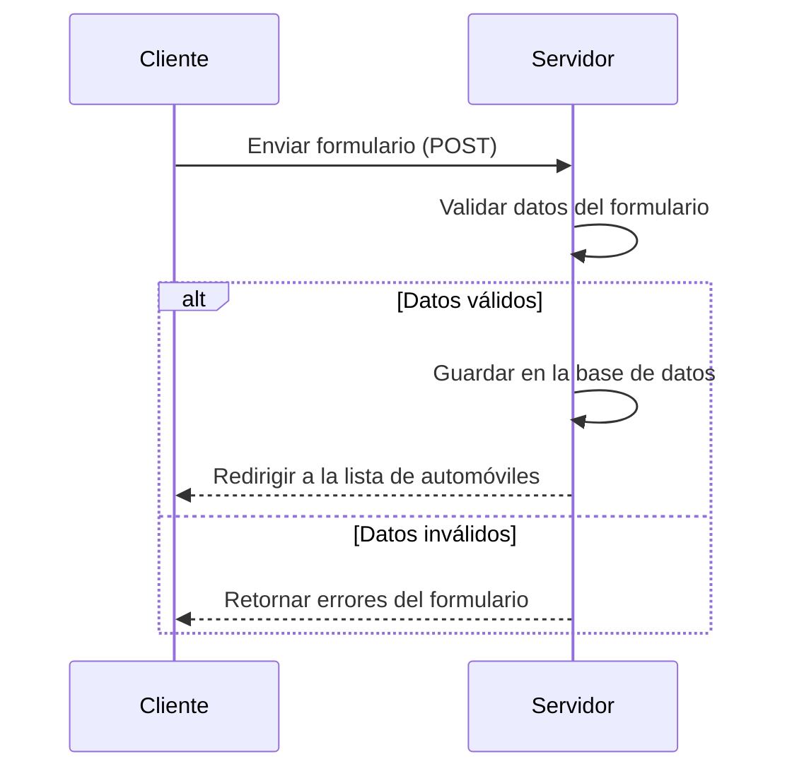

# Cómo se vincula el cliente y el servidor en los métodos POST

En una aplicación web, el cliente y el servidor se vinculan en los métodos POST a través de solicitudes HTTP. A continuación, se describe el flujo general:

## 1. **Formulario en el Cliente**
- El cliente (navegador) envía datos al servidor mediante un formulario HTML. En el archivo `crear_automovil.html`, el formulario tiene el atributo `method="POST"`, lo que indica que los datos se enviarán al servidor mediante una solicitud POST.

```html
<form method="POST">
    
    {{ form.as_p }}
    <button type="submit" class="btn btn-primary">Guardar</button>
</form>
```

- Aquí, el cliente envía los datos del formulario al servidor cuando el usuario hace clic en el botón "Guardar".

---

## 2. **Recepción en el Servidor**
- En el servidor, el framework (en este caso, Django) recibe la solicitud POST y procesa los datos. En el archivo `views.py`, la vista `crear_automovil` maneja esta solicitud.

```python
if request.method == 'POST':
    form = AutomovilModelForm(request.POST)
    if form.is_valid():
        form.save()  # Guarda el nuevo automóvil en la base de datos
        return redirect('lista_automoviles')  # Redirige a la lista de autos
```

- **Explicación**:
  - `request.POST`: Contiene los datos enviados desde el formulario.
  - `AutomovilModelForm(request.POST)`: Crea una instancia del formulario con los datos enviados.
  - `form.is_valid()`: Valida los datos del formulario.
  - `form.save()`: Guarda los datos en la base de datos si son válidos.
  - `redirect('lista_automoviles')`: Redirige al cliente a otra página después de procesar los datos.

---

## 3. **Respuesta al Cliente**
- Una vez que el servidor procesa los datos, envía una respuesta al cliente. En este caso, después de guardar el automóvil, el servidor redirige al cliente a la vista `lista_automoviles`.

---

## 4. **Protección con CSRF**
- Django incluye protección contra ataques CSRF (Cross-Site Request Forgery). En el formulario, el token `` asegura que la solicitud POST sea legítima y provenga del cliente autorizado.

---

## Resumen del Flujo
1. El cliente envía datos al servidor mediante un formulario HTML con `method="POST"`.
2. El servidor recibe los datos, los valida y los procesa.
3. El servidor envía una respuesta al cliente, como una redirección o un mensaje de éxito.

---

## Diagrama Secuencial
