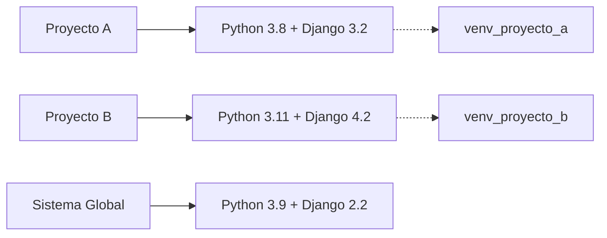
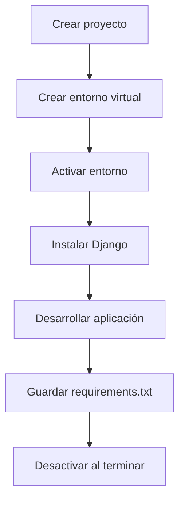

# 🚀 Módulo 6 - Django Framework
## 📋 Actividad Evaluativa 1

---

### 🎯 Objetivo

Comprender los conceptos teóricos fundamentales de Django, su estructura, entorno de desarrollo y la importancia de los entornos virtuales.

---

## 📚 Preguntas Teóricas

### 1. 🤔 ¿Qué es Django y por qué se usa?

**Django** es un framework de desarrollo web de alto nivel escrito en Python que fomenta el desarrollo rápido y el diseño limpio y pragmático.

**¿Por qué se usa Django?**
- ✅ **Desarrollo rápido**: Permite crear aplicaciones web complejas en menos tiempo
- ✅ **Seguridad incorporada**: Protección contra vulnerabilidades comunes (CSRF, XSS, SQL injection)
- ✅ **Escalabilidad**: Maneja grandes volúmenes de tráfico
- ✅ **Versatilidad**: Adecuado para diversos tipos de aplicaciones web
- ✅ **Comunidad activa**: Gran soporte y documentación

---

### 2. 🔄 Diferencias entre el entorno de desarrollo y producción en Django

| Aspecto | 🛠️ Desarrollo | 🌐 Producción |
|---------|---------------|---------------|
| **DEBUG** | `True` | `False` |
| **Base de datos** | SQLite (local) | PostgreSQL/MySQL |
| **Servidor** | Django dev server | Nginx + Gunicorn/uWSGI |
| **Archivos estáticos** | Servidos por Django | CDN o servidor web |
| **Configuración** | Menos estricta | Configuración optimizada |
| **Logs** | Console output | Archivos de log estructurados |
| **HTTPS** | Opcional | Obligatorio |

---

### 3. 🐍 Comparación entre Django y Python: ¿cómo se relacionan?


**Relación:**
- **Python** es el lenguaje de programación base
- **Django** es un framework construido sobre Python
- Django aprovecha las características de Python como:
  - Sintaxis clara y legible
  - Orientación a objetos
  - Amplia biblioteca estándar
  - Gestión automática de memoria

---

### 4. ⚡ ¿Por qué Django facilita el desarrollo de aplicaciones web?

#### 🏗️ Arquitectura MTV (Model-Template-View)
- **Model**: Manejo de datos y lógica de negocio
- **Template**: Presentación y interfaz de usuario
- **View**: Lógica de control y procesamiento

#### 🔧 Características que facilitan el desarrollo:

| Característica | Beneficio |
|----------------|-----------|
| **ORM integrado** | Abstrae la base de datos |
| **Admin automático** | Panel de administración sin código extra |
| **Sistema de templates** | Separación de lógica y presentación |
| **Manejo de formularios** | Validación y renderizado automático |
| **Sistema de URLs** | Enrutamiento elegante |
| **Middleware** | Procesamiento de requests/responses |

---

### 5. 🗄️ ¿Qué bases de datos soporta Django?

#### 📊 Bases de datos soportadas oficialmente:

| Base de datos | Logo | Características |
|---------------|------|-----------------|
| **PostgreSQL** | 🐘 | Recomendada, características avanzadas |
| **MySQL** | 🐬 | Popular, amplio soporte |
| **SQLite** | 📁 | Por defecto, ideal para desarrollo |
| **Oracle** | 🔶 | Empresarial, características avanzadas |

#### 🔌 Bases de datos con soporte de terceros:
- **MongoDB** (django-nonrel)
- **Redis** (para caché y sesiones)
- **Microsoft SQL Server**
- **IBM DB2**

---

### 6. 🏠 ¿Qué es un entorno virtual en Python y por qué es útil?

#### 📦 Definición
Un **entorno virtual** es un directorio que contiene una instalación aislada de Python con sus propios paquetes y dependencias.

#### 💡 ¿Por qué es útil?



**Beneficios:**
- 🔒 **Aislamiento**: Evita conflictos entre dependencias
- 🎯 **Específico**: Cada proyecto tiene sus propias versiones
- 🧹 **Limpieza**: No contamina el sistema global
- 📋 **Reproducibilidad**: Fácil de recrear en otros entornos
- 🚀 **Despliegue**: Garantiza consistencia en producción

---

### 7. 🛠️ ¿Cómo se crea y se usa un entorno virtual en Python?

#### 📝 Comandos básicos:

```bash
# 1. Crear entorno virtual
python -m venv nombre_del_entorno

# 2. Activar entorno virtual
# Windows (PowerShell)
nombre_del_entorno\Scripts\Activate.ps1

# Windows (Command Prompt)
nombre_del_entorno\Scripts\activate.bat

# Linux/Mac
source nombre_del_entorno/bin/activate

# 3. Instalar paquetes
pip install django

# 4. Guardar dependencias
pip freeze > requirements.txt

# 5. Instalar desde requirements
pip install -r requirements.txt

# 6. Desactivar entorno
deactivate
```

#### 🔄 Flujo de trabajo recomendado:



---

## 📚 Recursos adicionales

- 📖 [Documentación oficial de Django](https://docs.djangoproject.com/)
- 🎥 [Tutorial de Django](https://docs.djangoproject.com/en/stable/intro/tutorial01/)
- 🐍 [Guía de entornos virtuales](https://docs.python.org/3/tutorial/venv.html)

---

> **Nota**: Este documento forma parte del Módulo 6 - Django Framework del programa Talento Digital FS25.

*Última actualización: 30 de septiembre de 2025*
