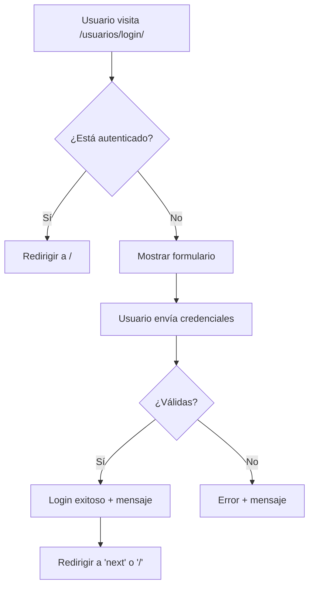
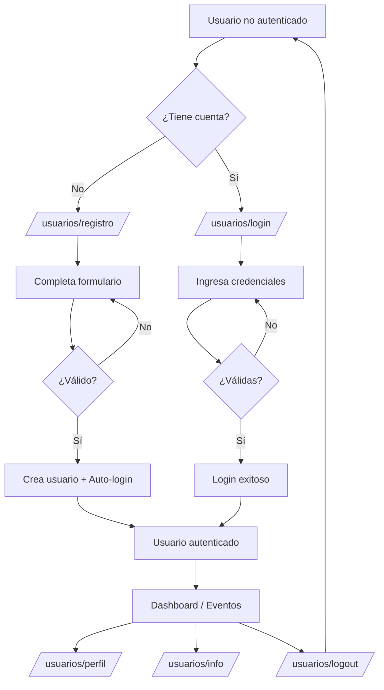

# 📚 Documentación: Sistema de Gestión de Usuarios

## 📋 Índice
1. [Descripción General](#descripción-general)
2. [Arquitectura](#arquitectura)
3. [Instalación y Configuración](#instalación-y-configuración)
4. [Funcionalidades](#funcionalidades)
5. [Estructura de Archivos](#estructura-de-archivos)
6. [API de Vistas](#api-de-vistas)
7. [Formularios](#formularios)
8. [Templates](#templates)
9. [Uso y Ejemplos](#uso-y-ejemplos)
10. [Seguridad](#seguridad)
11. [Testing](#testing)
12. [Troubleshooting](#troubleshooting)

---

## 🎯 Descripción General

La aplicación `app_usuarios` es un módulo independiente para Django que gestiona todo lo relacionado con el registro, autenticación y perfil de usuarios. Está diseñada siguiendo el principio de **separación de responsabilidades** y las mejores prácticas de Django.

### Características Principales
- ✅ Registro de nuevos usuarios con validación
- ✅ Autenticación (login/logout)
- ✅ Gestión de perfiles
- ✅ Validación de email único
- ✅ Integración con Bootstrap 5
- ✅ Mensajes de feedback al usuario
- ✅ Estadísticas de usuario
- ✅ Interfaz responsive

---

## 🏗️ Arquitectura

### Patrón de Diseño
La aplicación sigue el patrón **MTV (Model-Template-View)** de Django con **Class-Based Views (CBV)**.

```
┌─────────────────────────────────────────────────────┐
│                    USUARIO                           │
└──────────────────┬──────────────────────────────────┘
                   │
                   ▼
         ┌─────────────────┐
         │   URLs Router   │  (usuarios/urls.py)
         └────────┬────────┘
                  │
       ┌──────────┴──────────┐
       │                     │
       ▼                     ▼
  ┌─────────┐          ┌─────────┐
  │  Views  │◄────────►│  Forms  │
  └────┬────┘          └─────────┘
       │
       ▼
  ┌──────────┐
  │Templates │
  └──────────┘
```

### Componentes

| Componente | Responsabilidad |
|-----------|----------------|
| **views.py** | Lógica de negocio, control de flujo |
| **forms.py** | Validación y presentación de formularios |
| **urls.py** | Enrutamiento de URLs |
| **templates/** | Presentación visual (HTML) |

---

## 🔧 Instalación y Configuración

### 1. Registrar la App

En `project_eventos/settings.py`:

```python
INSTALLED_APPS = [
    # ... otras apps
    'app_eventos',
    'app_usuarios',  # ← Agregar esta línea
]
```

### 2. Configurar URLs de Autenticación

En `project_eventos/settings.py`:

```python
# Configuración de autenticación
LOGIN_URL = '/usuarios/login/'
LOGIN_REDIRECT_URL = '/'
LOGOUT_REDIRECT_URL = '/usuarios/login/'
```

### 3. Incluir URLs de la App

En `project_eventos/urls.py`:

```python
from django.urls import path, include

urlpatterns = [
    path('admin/', admin.site.urls),
    path('usuarios/', include('app_usuarios.urls')),  # ← Agregar
    path('', include('app_eventos.urls')),
]
```

### 4. Aplicar Migraciones

Aunque no hay modelos personalizados, es buena práctica:

```bash
python manage.py makemigrations
python manage.py migrate
```

### 5. Crear Superusuario (Opcional)

```bash
python manage.py createsuperuser
```

---

## 🚀 Funcionalidades

### 1. Registro de Usuarios

**URL:** `/usuarios/registro/`  
**Vista:** `RegistroView`  
**Template:** `usuarios/registro.html`

#### Características:
- ✅ Formulario con campos: nombre, apellido, username, email, contraseñas
- ✅ Validación de email único
- ✅ Validación de username único
- ✅ Validación de contraseña fuerte (Django validators)
- ✅ Auto-login después del registro
- ✅ Redirección si el usuario ya está autenticado

#### Validaciones:
```python
# Email único
def clean_email(self):
    email = self.cleaned_data.get('email')
    if User.objects.filter(email=email).exists():
        raise forms.ValidationError('Este correo electrónico ya está registrado.')
    return email

# Username único
def clean_username(self):
    username = self.cleaned_data.get('username')
    if User.objects.filter(username=username).exists():
        raise forms.ValidationError('Este nombre de usuario ya está en uso.')
    return username
```

---

### 2. Inicio de Sesión

**URL:** `/usuarios/login/`  
**Vista:** `LoginView`  
**Template:** `usuarios/login.html`

#### Características:
- ✅ Formulario simple (username, password)
- ✅ Checkbox "Recordarme"
- ✅ Soporte para parámetro `?next=` (redirección después del login)
- ✅ Mensaje de bienvenida personalizado
- ✅ Redirección automática si ya está autenticado

#### Flujo:


---

### 3. Cierre de Sesión

**URL:** `/usuarios/logout/`  
**Vista:** `LogoutView`  
**Requiere:** Autenticación

#### Características:
- ✅ Cierre de sesión automático
- ✅ Mensaje de despedida con nombre del usuario
- ✅ Redirección al login

---

### 4. Perfil de Usuario

**URL:** `/usuarios/perfil/`  
**Vista:** `PerfilView`  
**Template:** `usuarios/perfil.html`  
**Requiere:** Autenticación

#### Características:
- ✅ Visualización de datos del usuario
- ✅ Edición de: nombre, apellido, email
- ✅ Username **NO editable** (seguridad)
- ✅ Validación de email único
- ✅ Sidebar con información adicional
- ✅ Fecha de registro y último acceso

#### Campos Editables:

| Campo | Editable | Validación |
|-------|----------|------------|
| Username | ❌ No | - |
| Email | ✅ Sí | Único, formato válido |
| Nombre | ✅ Sí | Requerido |
| Apellido | ✅ Sí | Requerido |
| Contraseña | ❌ No | Contactar admin |

---

### 5. Información del Usuario

**URL:** `/usuarios/info/`  
**Vista:** `InfoUsuarioView`  
**Template:** `usuarios/info_usuario.html`  
**Requiere:** Autenticación

#### Características:
- ✅ Estadísticas del usuario
- ✅ Lista de eventos creados
- ✅ Lista de eventos participando
- ✅ Contadores visuales
- ✅ Acciones rápidas (salirse de eventos)

#### Información Mostrada:
```python
context = {
    'eventos_creados': user.evento_set.all(),
    'total_eventos_creados': user.evento_set.count(),
    'eventos_participando': user.eventos_participando.all(),
    'total_eventos_participando': user.eventos_participando.count(),
}
```

---

## 📁 Estructura de Archivos

```
app_usuarios/
├── __init__.py
├── admin.py                    # Configuración del admin (vacío por ahora)
├── apps.py                     # Configuración de la app
├── forms.py                    # RegistroForm, PerfilForm
├── models.py                   # Sin modelos personalizados
├── tests.py                    # Tests unitarios
├── urls.py                     # Rutas de la app
├── views.py                    # Vistas CBV
├── templates/
│   └── usuarios/
│       ├── registro.html       # Formulario de registro
│       ├── login.html          # Formulario de login
│       ├── perfil.html         # Edición de perfil
│       └── info_usuario.html   # Estadísticas
└── migrations/
    └── __init__.py
```

---

## 🎨 API de Vistas

### RegistroView

```python
class RegistroView(CreateView)
```

| Atributo | Valor |
|----------|-------|
| **form_class** | `RegistroForm` |
| **template_name** | `usuarios/registro.html` |
| **success_url** | `reverse_lazy('lista_eventos')` |

**Métodos:**

```python
def form_valid(self, form):
    """Guarda el usuario y lo autentica automáticamente."""
    response = super().form_valid(form)
    login(self.request, self.object)
    messages.success(self.request, f'¡Bienvenido {self.object.username}!')
    return response

def dispatch(self, request, *args, **kwargs):
    """Redirige si el usuario ya está autenticado."""
    if request.user.is_authenticated:
        return redirect('lista_eventos')
    return super().dispatch(request, *args, **kwargs)
```

---

### LoginView

```python
class LoginView(DjangoLoginView)
```

| Atributo | Valor |
|----------|-------|
| **template_name** | `usuarios/login.html` |
| **redirect_authenticated_user** | `True` |

**Métodos:**

```python
def get_success_url(self):
    """Prioriza: next parameter > eventos"""
    next_url = self.request.GET.get('next')
    return next_url if next_url else reverse_lazy('lista_eventos')

def form_valid(self, form):
    """Muestra mensaje de bienvenida."""
    messages.success(self.request, f'¡Bienvenido de nuevo, {form.get_user().username}!')
    return super().form_valid(form)
```

---

### PerfilView

```python
class PerfilView(LoginRequiredMixin, UpdateView)
```

| Atributo | Valor |
|----------|-------|
| **form_class** | `PerfilForm` |
| **template_name** | `usuarios/perfil.html` |
| **success_url** | `reverse_lazy('perfil')` |

**Métodos:**

```python
def get_object(self, queryset=None):
    """Retorna el usuario autenticado actual."""
    return self.request.user
```

---

### InfoUsuarioView

```python
class InfoUsuarioView(LoginRequiredMixin, TemplateView)
```

| Atributo | Valor |
|----------|-------|
| **template_name** | `usuarios/info_usuario.html` |

**Métodos:**

```python
def get_context_data(self, **kwargs):
    """Añade información del usuario al contexto."""
    context = super().get_context_data(**kwargs)
    user = self.request.user
    
    context['eventos_creados'] = user.evento_set.all().order_by('-fecha_inicio')
    context['total_eventos_creados'] = user.evento_set.count()
    context['eventos_participando'] = user.eventos_participando.all().order_by('-fecha_inicio')
    context['total_eventos_participando'] = user.eventos_participando.count()
    
    return context
```

---

## 📝 Formularios

### RegistroForm

```python
class RegistroForm(UserCreationForm)
```

**Campos:**
- `username` (CharField)
- `email` (EmailField) - Requerido, único
- `first_name` (CharField) - Requerido
- `last_name` (CharField) - Requerido
- `password1` (CharField)
- `password2` (CharField)

**Widgets Bootstrap:**
```python
widget=forms.EmailInput(attrs={
    'class': 'form-control',
    'placeholder': 'correo@ejemplo.com'
})
```

**Validaciones Personalizadas:**
- Email único en la base de datos
- Username único en la base de datos
- Contraseña mínimo 8 caracteres (Django validator)
- Contraseña no puede ser similar al username

---

### PerfilForm

```python
class PerfilForm(forms.ModelForm)
```

**Campos:**
- `username` (CharField) - **Disabled**
- `email` (EmailField) - Único
- `first_name` (CharField)
- `last_name` (CharField)

**Inicialización:**
```python
def __init__(self, *args, **kwargs):
    super().__init__(*args, **kwargs)
    self.fields['username'].disabled = True
    self.fields['username'].help_text = 'El nombre de usuario no puede ser modificado.'
```

**Validación Email:**
```python
def clean_email(self):
    email = self.cleaned_data.get('email')
    if User.objects.filter(email=email).exclude(pk=self.instance.pk).exists():
        raise forms.ValidationError('Este correo electrónico ya está en uso.')
    return email
```

---

## 🎨 Templates

### Jerarquía de Templates

```
base.html (app_eventos/templates/)
    │
    ├── usuarios/registro.html
    ├── usuarios/login.html
    ├── usuarios/perfil.html
    └── usuarios/info_usuario.html
```

### Componentes Comunes

#### 1. Mensajes de Django

Todos los templates usan el sistema de mensajes:

```django

    <div class="messages-container">
        
            <div class="alert alert-{{ message.tags }} alert-dismissible fade show">
                {{ message }}
                <button type="button" class="btn-close" data-bs-dismiss="alert"></button>
            </div>
        
    </div>

```

#### 2. Errores de Formularios

```django

    <div class="alert alert-danger">
        <i class="bi bi-exclamation-triangle-fill me-2"></i>
        {{ form.non_field_errors }}
    </div>


<!-- Para cada campo -->

    <div class="invalid-feedback d-block">
        {{ form.email.errors }}
    </div>

```

---

## 💡 Uso y Ejemplos

### Ejemplo 1: Registro de Usuario

```python
# Usuario visita /usuarios/registro/
# 1. Llena el formulario
username = "juan_perez"
email = "juan@ejemplo.com"
password = "MiPassword123!"

# 2. Submit del formulario
# 3. RegistroView.form_valid() ejecuta:
user = form.save()  # Crea el usuario
login(request, user)  # Auto-login
messages.success(request, f'¡Bienvenido {user.username}!')

# 4. Redirige a: /
```

---

### Ejemplo 2: Editar Perfil

```python
# Usuario autenticado visita /usuarios/perfil/

# GET request:
# - PerfilView.get_object() retorna request.user
# - Formulario pre-poblado con datos actuales

# POST request con cambios:
new_email = "nuevo_email@ejemplo.com"

# PerfilForm.clean_email() valida:
# - ¿Email ya existe? → Error
# - ¿Email válido? → OK

# Si válido:
user.email = new_email
user.save()
messages.success(request, 'Tu perfil ha sido actualizado.')
```

---

### Ejemplo 3: Integración con Eventos

```python
# En app_eventos/views.py

from django.contrib.auth.mixins import LoginRequiredMixin

class CrearEvento(LoginRequiredMixin, CreateView):
    # Si usuario no autenticado, redirige a:
    # /usuarios/login/?next=/crear_evento/
    
    def form_valid(self, form):
        form.instance.autor = self.request.user  # Usuario del sistema
        return super().form_valid(form)
```

---

## 🔒 Seguridad

### 1. Validaciones Implementadas

| Validación | Ubicación | Descripción |
|-----------|-----------|-------------|
| **Email único** | `RegistroForm.clean_email()` | Previene duplicados |
| **Username único** | `RegistroForm.clean_username()` | Previene duplicados |
| **Contraseña fuerte** | Django validators | Min 8 chars, no común |
| **Email único en edición** | `PerfilForm.clean_email()` | Excluye usuario actual |

### 2. Protección de Vistas

```python
# Requiere autenticación
class PerfilView(LoginRequiredMixin, UpdateView):
    pass

# Si no autenticado, redirige a LOGIN_URL
```

### 3. CSRF Protection

Todos los formularios incluyen:
```django
<form method="post">
    
    <!-- campos del formulario -->
</form>
```

### 4. Username No Editable

```python
def __init__(self, *args, **kwargs):
    super().__init__(*args, **kwargs)
    self.fields['username'].disabled = True  # Previene cambios
```

**Razón:** Cambiar username puede romper referencias en eventos y participaciones.

---

## 🧪 Testing

### Tests Recomendados

```python
# app_usuarios/tests.py

from django.test import TestCase, Client
from django.contrib.auth.models import User
from django.urls import reverse

class RegistroTests(TestCase):
    
    def test_registro_exitoso(self):
        """Prueba registro con datos válidos"""
        response = self.client.post(reverse('registro'), {
            'username': 'testuser',
            'email': 'test@example.com',
            'first_name': 'Test',
            'last_name': 'User',
            'password1': 'TestPass123!',
            'password2': 'TestPass123!',
        })
        self.assertEqual(response.status_code, 302)  # Redirect
        self.assertTrue(User.objects.filter(username='testuser').exists())
    
    def test_email_duplicado(self):
        """Prueba que no permite emails duplicados"""
        User.objects.create_user('user1', 'test@example.com', 'pass')
        
        response = self.client.post(reverse('registro'), {
            'username': 'user2',
            'email': 'test@example.com',  # Email duplicado
            'first_name': 'Test',
            'last_name': 'User',
            'password1': 'TestPass123!',
            'password2': 'TestPass123!',
        })
        
        self.assertFormError(response, 'form', 'email', 
                            'Este correo electrónico ya está registrado.')

class LoginTests(TestCase):
    
    def setUp(self):
        self.user = User.objects.create_user('testuser', 'test@example.com', 'testpass')
    
    def test_login_exitoso(self):
        """Prueba login con credenciales válidas"""
        response = self.client.post(reverse('login'), {
            'username': 'testuser',
            'password': 'testpass',
        })
        self.assertEqual(response.status_code, 302)
        self.assertTrue(response.wsgi_request.user.is_authenticated)

class PerfilTests(TestCase):
    
    def setUp(self):
        self.user = User.objects.create_user('testuser', 'test@example.com', 'testpass')
        self.client.login(username='testuser', password='testpass')
    
    def test_perfil_requiere_login(self):
        """Prueba que perfil requiere autenticación"""
        self.client.logout()
        response = self.client.get(reverse('perfil'))
        self.assertEqual(response.status_code, 302)  # Redirect a login
    
    def test_editar_perfil(self):
        """Prueba edición de perfil"""
        response = self.client.post(reverse('perfil'), {
            'username': 'testuser',  # No cambia
            'email': 'nuevo@example.com',
            'first_name': 'Nuevo',
            'last_name': 'Nombre',
        })
        self.user.refresh_from_db()
        self.assertEqual(self.user.email, 'nuevo@example.com')
```

### Ejecutar Tests

```bash
python manage.py test app_usuarios
```

---

## 🔧 Troubleshooting

### Problema 1: "Page not found (404)" en /usuarios/registro/

**Causa:** URLs no configuradas correctamente.

**Solución:**
```python
# project_eventos/urls.py
urlpatterns = [
    path('usuarios/', include('app_usuarios.urls')),  # ← Verificar esta línea
]
```

---

### Problema 2: Formulario no muestra estilos de Bootstrap

**Causa:** Widgets no configurados con clases CSS.

**Solución:**
```python
# forms.py
email = forms.EmailField(
    widget=forms.EmailInput(attrs={'class': 'form-control'})  # ← Agregar clase
)
```

---

### Problema 3: Usuario no se redirige después del login

**Causa:** `LOGIN_REDIRECT_URL` no configurado.

**Solución:**
```python
# settings.py
LOGIN_REDIRECT_URL = '/'  # o la URL que desees
```

---

### Problema 4: "This field is required" en username al editar perfil

**Causa:** Campo disabled no se envía en POST.

**Solución:**
El formulario ya maneja esto correctamente. Si persiste:
```python
# forms.py - PerfilForm
class Meta:
    model = User
    fields = ['email', 'first_name', 'last_name']  # Excluir username
```

---

### Problema 5: Mensajes de Django no se muestran

**Causa:** Template no incluye ``.

**Solución:**
```django
<!-- En base.html o en cada template -->

    
        <div class="alert alert-{{ message.tags }}">
            {{ message }}
        </div>
    

```

---

## 📊 Diagrama de Flujo Completo



---

## 🎓 Mejores Prácticas Implementadas

1. ✅ **Separación de Responsabilidades**: App independiente para usuarios
2. ✅ **Class-Based Views**: Reutilización de código
3. ✅ **Validación Robusta**: Email y username únicos
4. ✅ **Seguridad**: CSRF, LoginRequired, validación de contraseñas
5. ✅ **UX/UI**: Mensajes de feedback, Bootstrap 5, responsive
6. ✅ **Documentación**: Código documentado con docstrings
7. ✅ **DRY (Don't Repeat Yourself)**: Herencia de formularios
8. ✅ **Extensibilidad**: Fácil agregar nuevas funcionalidades

---

## 🚀 Próximas Mejoras (Roadmap)

- [ ] Recuperación de contraseña (password reset)
- [ ] Verificación de email
- [ ] Foto de perfil
- [ ] Cambio de contraseña desde el perfil
- [ ] Two-Factor Authentication (2FA)
- [ ] OAuth2 (Google, Facebook login)
- [ ] Historial de actividad
- [ ] Notificaciones por email

---

## 📞 Contacto y Soporte

**Desarrollador:** Sistema de Eventos Django  
**Versión:** 1.0.0  
**Framework:** Django 5.2.8  
**Python:** 3.x

---

## 📄 Licencia

Este proyecto es parte de un ejercicio educativo para la gestión de eventos con Django.

---

**Última actualización:** Noviembre 2025
