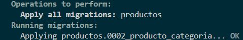

# Agregar campo categoria

SOLUCIONAR : django.db.utils.OperationalError: no such column: productos_producto.categoria

1. Crear una nueva migración para agregar el campo "categoria"
```bash
python manage.py makemigrations productos
```


```bash
Migrations for 'productos':
  productos\migrations\0002_producto_categoria.py
    + Add field categoria to producto
```
2. Aplicar la migración
```bash
python manage.py migrate productos



```bash
Operations to perform:
  Apply all migrations: productos
Running migrations:
  Applying productos.0002_producto_categoria... OK
```

# finalmente modificar template
modificar templates/productos/producto_form.html
modificar templates/productos/producto_list.html
